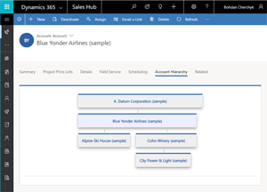
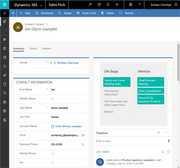

# Contributing

This project welcomes contributions and suggestions.  Most contributions require you to agree to a
Contributor License Agreement (CLA) declaring that you have the right to, and actually do, grant us
the rights to use your contribution. For details, visit https://cla.microsoft.com.

When you submit a pull request, a CLA-bot will automatically determine whether you need to provide
a CLA and decorate the PR appropriately (e.g., label, comment). Simply follow the instructions
provided by the bot. You will only need to do this once across all repos using our CLA.

This project has adopted the [Microsoft Open Source Code of Conduct](https://opensource.microsoft.com/codeofconduct/).
For more information see the [Code of Conduct FAQ](https://opensource.microsoft.com/codeofconduct/faq/) or
contact [opencode@microsoft.com](mailto:opencode@microsoft.com) with any additional questions or comments.

# PowerApps Custom Control Project Template

This is a PowerApps custom control project template leveraging node.js.  Custom controls were built using PowerApps Control Framework (PCF).

## Prerequisites
1. Prior building solution make sure you have [node.js](https://nodejs.org/) installed.
2. During development we were using [Visual Studio Code](https://code.visualstudio.com/) as IDE.

## GIT Cheatsheet
1. `git clone https://github.com/nicknow/PowerApps-Custom-Control-Project-Template.git` - to load code from repository
1. `git checkout -b NewBranch` - to create a new branch NewBranch
1. `git add .` - to stage changes 
1. `git commit -m firstCommit` - to commit changes
1. `git push origin firstCommit` - to push NewBranch branch to remote

## Preparing Solution
1. `npm install`

## Building Solution
1. `npm run build`
After successful running you will receive `solution.zip`.  Use `solution.zip` to upload it to your Dynamics instance.

# Controls
1. [CC.Hierarchy  
	](src/Controls/CC.Hierarchy/README.md)  
1. [CC.LifeStage  
	](src/Controls/CC.LifeStage/README.md)  
	

