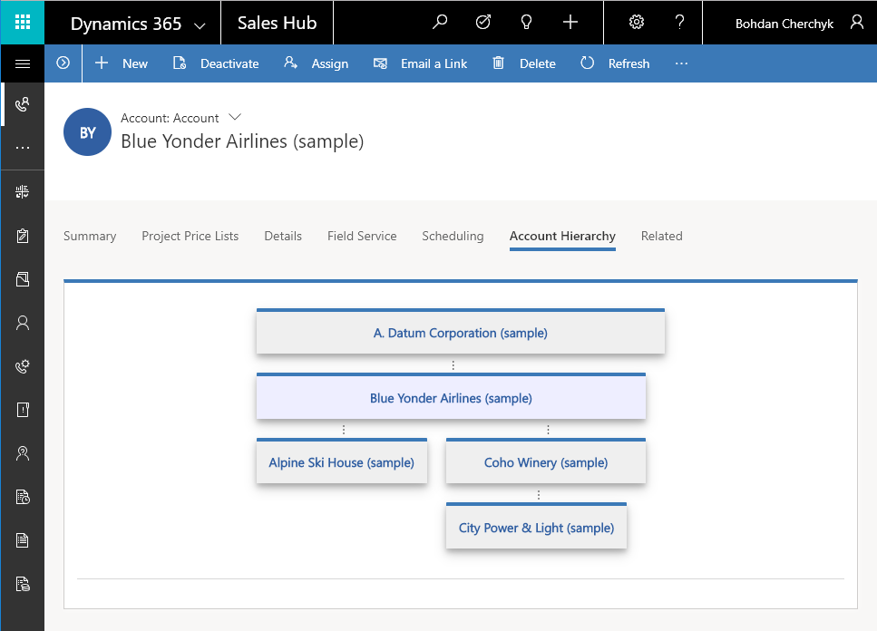

# CC.Hierarchy

CC.Hierarchy control renders account hierarchy.

It's recommended to place control on the separate tab.  

Control can be added to form on top any text field, for example `Account Name`.

]